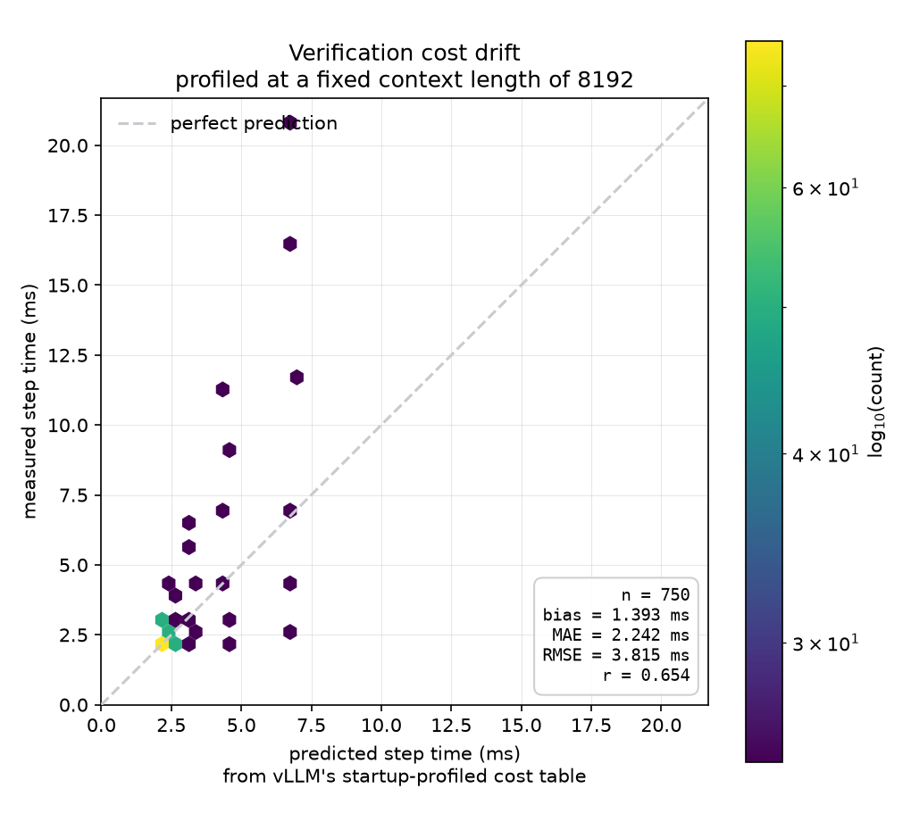
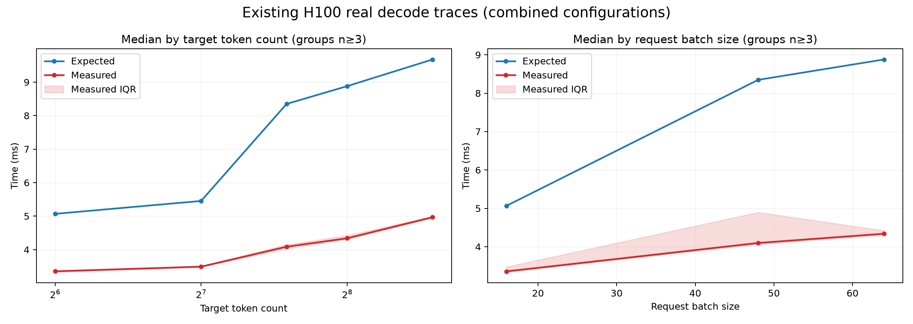

# Context-Aware Verification Cost Modeling for vLLM DSpark

An empirical systems study of how vLLM estimates speculative-verification cost,
why the estimate drifts under variable sequence lengths, and whether fixing the
estimate improves end-to-end throughput.

`Python` · `PyTorch` · `vLLM` · `CUDA Graphs` · `H100` · `Slurm`

> **Status:** The cost-model hypothesis is validated on H100. A calibrated
> serving A/B shows that more accurate costs change DSpark's decisions but do
> not automatically improve throughput. An exact-token context sweep is ready
> to test how that result changes across input lengths.

## Why this project exists

DSpark's adaptive verifier decides how many draft tokens the target model should
verify in each decode step. vLLM currently prices that choice with a startup
profile indexed primarily by the number of new target tokens:

```text
stock_cost = f(num_target_tokens)
```

That treats two batches as equivalent when they verify the same number of new
tokens—even if one batch has far more historical KV context to read.

This project tests the missing dimension and finds that, in the CUDA-graph
regime, target time is well described by:

```text
cost ~= f(num_target_tokens) + k * sum(sequence_lengths)
```

Where:

- `num_target_tokens` is the new verification work in the current step: normal
  decode positions plus selected draft candidates.
- `sum(sequence_lengths)` is the aggregate historical context across active
  requests.
- `k` is a model- and hardware-specific KV-read cost.

The deployed correction is relative to the context already embedded in
vLLM's startup profile:

```text
corrected_cost[t] = stock_cost[t]
                  + k * (real_sum_seq_lens - profiled_sum_seq_lens[t])
```

## Headline findings

| Finding | Evidence |
|---|---|
| Sequence length is a missing cost feature | At fixed target-token count, measured latency changes substantially with aggregate KV context. |
| The error is predictable | On held-out contexts, a one-scalar additive model reduces RMSE from `5.779 ms` to `0.496 ms`—an **11.6× reduction**. |
| The sign depends on context | Below the profile context, stock overpredicts; above it, stock underpredicts by as much as **203%** in the tested Qwen/H100 sweep. |
| `k` is model-specific | H100 fits give `0.0356 us/KV-token` for Qwen3-1.7B and `0.0137 us/KV-token` for MiniCPM5-2B. Transferring `k` across models is invalid. |
| Accurate prediction changes real decisions | In the calibrated MiniCPM/spec-7 A/B, decode ceiling selection fell from `97.98%` to `89.17%`. |
| Accurate prediction is not sufficient for speedup | The correction was **0.365% slower** on the tested workload because draft trimming produced 13 additional decode batches across 20 paired runs. |

## The context-dependent sign flip

The startup table represents one fixed profile context. Real serving batches
can fall on either side of it:

```text
real context < profile context  -> stock overpredicts
real context > profile context  -> stock underpredicts
```

The H100 context-straddle experiment confirms that prediction: error crosses
zero at the profile point and reverses direction beyond it.

<p align="center">
  
</p>

## Comparison with real decode traces

The grouped real-step view mirrors the target-token and request-count panels in
[vLLM issue #52057](https://github.com/vllm-project/vllm/issues/52057). In this
repository's short-context traces, prediction error grows with target shape and
request count, but measured time stays below the startup estimate because the
active contexts are shorter than the profile context.

<p align="center">
  
</p>

This is the same structural limitation—one cost per target-token count cannot
represent variable sequence lengths—but at a different operating point.

## Why the accurate cost was slightly slower

With 64 requests and `spec=7`, a full decode step can contain:

```text
64 normal decode positions + 64 * 7 draft candidates = 512 target tokens
```

Stock vLLM overestimated the typical verification step:

```text
stock estimate       8.622 ms
corrected estimate   6.030 ms
median adjustment   -2.585 ms
```

When verification appeared expensive, the stock policy kept almost every
available draft token to amortize the target pass. Once verification appeared
cheaper, the corrected policy sometimes removed 8 or 16 candidates. That saved
draft-model work but left some requests active for another batched target pass.

Across 20 paired rounds with identical output:

```text
stock decode decisions       347
corrected decode decisions   360
additional decode batches     13

stock median throughput       10,971.9 tokens/s
corrected median throughput   10,923.5 tokens/s
paired mean delta             -0.3649%
```

The result is not “accurate costs are bad.” It shows that prediction and
decision quality are separate problems: the existing objective does not fully
price the future cost of needing another decode iteration.

## Experimental design

The benchmarks include safeguards for common GPU-measurement failures:

- Warm every execution shape before timing any shape, preventing JIT and
  autotuning from being assigned to one configuration.
- Interleave and reverse measurement order to distribute thermal and clock
  drift.
- Separate CUDA-graph and eager regimes rather than averaging incompatible
  behavior.
- Calibrate `k` inside the same live DSpark engine used by the A/B.
- Reconstruct vLLM's actual profile baseline, including max-length capping,
  query tokens, CUDA-graph padding, and eager-tail interpolation.
- Alternate stock/corrected order within paired rounds.
- Require equal output-token counts and reject selected costs that hit the
  minimum positive-value clamp.

One early allocation experiment demonstrated why these controls matter:
shape-specific compilation initially created a false 28% difference. After
global warmup and interleaved timing, the difference fell to 0.21%.

## Repository guide

| Path | Purpose |
|---|---|
| [`bench/verify_cost_probe.py`](bench/verify_cost_probe.py) | Controlled target-cost sweeps over token count, request count, and context. |
| [`bench/fit_cost_model.py`](bench/fit_cost_model.py) | Fits and validates additive versus max-like context models. |
| [`bench/marginal_cost_probe.py`](bench/marginal_cost_probe.py) | Tests whether cost depends on which request owns an extra draft token. |
| [`bench/step_trace.py`](bench/step_trace.py) | Captures predicted and measured target time during real generation. |
| [`bench/serving_ab.py`](bench/serving_ab.py) | In-engine calibration, correction injection, paired serving A/B, and exact-token sweep. |
| [`bench/plot_drift.py`](bench/plot_drift.py) | Expected-versus-measured drift visualization. |
| [`bench/plot_grouped_drift.py`](bench/plot_grouped_drift.py) | Issue-compatible grouped target-token and request-count panels. |
| [`pace/`](pace/) | Reproducible Slurm launchers for H100 experiments. |
| [`results/`](results/) | Raw JSON measurements and generated figures. |
| [`FINDINGS.md`](FINDINGS.md) | Full experiment log, corrections, negative results, and limitations. |
| [`SETUP.md`](SETUP.md) | Environment and vLLM setup notes. |

## Reproducing the main experiment

The final sweep targets Hopper because adaptive verification uses the
FlashAttention 3 CUDA-graph path in this configuration. It requires cached
model weights, the pinned vLLM environment described in
[`SETUP.md`](SETUP.md), and one H100-class GPU. The checked-in Slurm scripts
also contain cluster-specific module and Conda paths that should be adapted for
another environment.

```bash
git clone https://github.com/adixg/vllm-specdecode-cost-model.git
cd vllm-specdecode-cost-model

sbatch pace/run_serving_context_sweep.sbatch
```

The job performs one in-engine calibration and then compares stock versus
corrected scheduling at exact homogeneous input lengths:

```text
64, 512, 1024, 2048, 3000 input tokens
64 simultaneous requests
128 generated tokens per request
20 paired stock/corrected rounds per length
```

Expected outputs:

```text
results/minicpm_h100_dspark_k_spec7_context_sweep.json
results/h100_exact_context_sweep_spec7.json
logs/serving-ctx-sweep-<job-id>.out
logs/serving-ctx-sweep-<job-id>.err
```

To regenerate the grouped plots from existing data:

```bash
.venv/bin/python bench/plot_grouped_drift.py \
  --real-step-files \
    results/h100_step_trace.json \
    results/sat_spec3_seqs16.json \
    results/sat_spec3_seqs64.json \
    results/sat_spec7_seqs16.json \
    results/sat_spec7_seqs64.json \
  --out results/h100_grouped_real_decode.png
```

## Scope and limitations

- The strongest accuracy results cover two small language models on one H100
  generation; `k` must be recalibrated for other model/GPU combinations.
- Controlled probes use synthetic, uniform contexts to isolate causality.
- The calibrated end-to-end result is scoped to MiniCPM5-2B, DSpark `spec=7`,
  64 simultaneous requests, and 128 generated tokens per request.
- Earlier uncalibrated serving JSON files are retained for provenance but are
  explicitly marked as superseded in [`FINDINGS.md`](FINDINGS.md).
- Continuous arrivals and broader model coverage remain future work.

## Project takeaway

This project began with a profiling discrepancy and ended with a broader
systems result:

```text
Better measurement does not guarantee a better policy.
```

Aggregate context makes verification cost substantially more predictable.
Once that measurement error is removed, the next bottleneck is the adaptive
scheduler's objective—specifically, how it values saved draft work against the
possibility of an additional target-model iteration.
